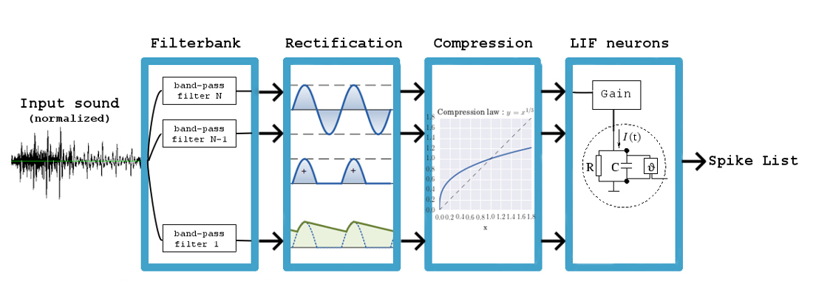

# SimpleCochlea

SimpleCochlea is a basic cochlea model for transforming an input sound into a spike-list.



Author : Martin Deudon (2018). Contact : <martin.deudon@protonmail.com>

## Documentation 

The doc is here : https://simplecochlea.readthedocs.io/en/latest/

## Installation

A C/C++ compiler is needed for installing the *simplecochlea* package. Windows users can download Microsoft Visual Studio which includes a compiler. See [https://wiki.python.org/moin/WindowsCompilers](https://wiki.python.org/moin/WindowsCompilers) to know which version of Microsoft Visual C++ is more suited to your Python version.

*simplecochlea* will not work with python 2 :

The installation script needs *numpy* and *cython* packages to be installed.

```shell
pip install numpy cython
```

To install *simplecochlea*, open a terminal and run (will only work if git is installed) : 

```shell
pip install git+https://github.com/tinmarD/simplecochlea.git@master
```

